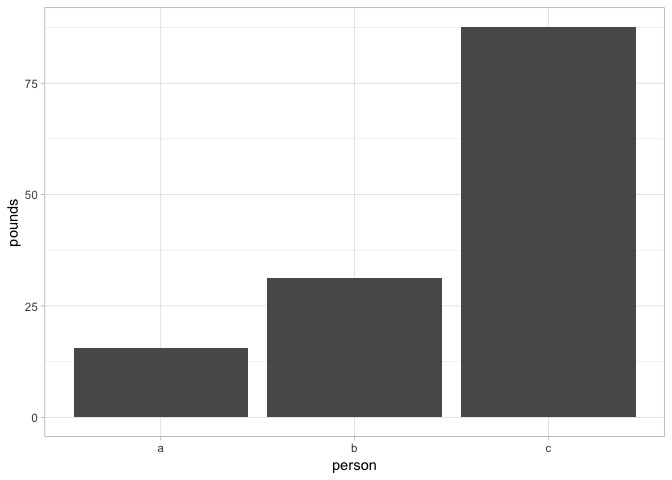

<!-- README.md is generated from README.Rmd. Please edit that file -->
debkeepr: Analysis of Non-Decimal Currencies
============================================

[](https://travis-ci.org/jessesadler/debkeepr) [](https://codecov.io/github/jessesadler/debkeepr?branch=master)

`debkeepr` provides an interface for working with non-decimal currencies that use the tripartite system of pounds, shillings, and pence. The package includes functions to apply arithmetic and financial operations to single or multiple values and to analyze account books that use either [single-entry bookkeeping](https://en.wikipedia.org/wiki/Single-entry_bookkeeping_system) or [double-entry bookkeeping](https://en.wikipedia.org/wiki/Double-entry_bookkeeping_system) with the latter providing the name for `debkeepr`.

Installation
------------

You can install `debkeepr` from GitHub with [devtools](https://github.com/hadley/devtools):

``` r
# install.packages("devtools")
devtools::install_github("jessesadler/debkeepr")
```

lsd Class
---------

The pounds, shillings, and pence monetary system complicates even relatively simple arithmetic manipulations, as each unit has to be [normalized](https://en.wikipedia.org/wiki/Arithmetic#Compound_unit_arithmetic) or converted to the correct base. To unite pounds, shillings, and pence units into a single value and associate the shillings and pence units with non-decimal bases `debkeepr` implements a special class of R object. The **lsd** class consists of a list of one or more numeric vectors of length 3 and a `bases` attribute attached to the list. `debkeepr` provides functions to manipulate `lsd` objects on their own or within a data frame as a list column.

Historical Background
---------------------

The `debkeepr` package uses the nomenclature of [l, s, and d](https://en.wikipedia.org/wiki/%C2%A3sd) to represent pounds, shillings, and pence units. The abbreviations derive from the Latin terms [libra](https://en.wikipedia.org/wiki/French_livre), [solidus](https://en.wikipedia.org/wiki/Solidus_(coin)), and [denarius](https://en.wikipedia.org/wiki/Denarius). The libra was a Roman measurement of weight, while the solidus and denarius were both Roman coins. The denarius was a silver coin from the era of the Republic, in contrast to the golden solidus that was issued in the Late Empire. As the production of silver coins overtook that of gold by the 8th century, a solidus came to represent 12 silver denarii coins, and 240 denarii were — for a time — made from one libra or pound of silver. The custom of counting coins in dozens (solidi) and scores of dozens (librae) spread throughout the Carolingian Empire and became engrained in much of Europe. However, a variety of [other bases](https://en.wikipedia.org/wiki/Non-decimal_currency) for the solidi and denarii units were in use in different regions and at different times. `debkeepr` provides a consistent manner for dealing with any set of bases within a tripartite system through the `bases` attribute of an `lsd` object.

Resources
---------

-   [Getting Started with debkeepr vignette](https://jessesadler.github.io/debkeepr/articles/debkeepr.html): An overview of `debkeepr`’s functions and their use in various contexts.
-   [Transactions in Richard Dafforne's Journal vignette](https://jessesadler.github.io/debkeepr/articles/transactions.html): Examples of financial and arithmetic calculations dealing with various currencies taken from the example journal in Richard Dafforne’s *Merchant’s Mirrour* (1660).
-   Analysis of Richard Dafforne’s Journal and Ledger vignette (coming soon): An analysis of the example journal and ledger in Dafforne’s *Merchant’s Mirrour* using the `dafforne_transactions` and `dafforne_accounts` data provided in `debkeepr`.
-   A [PDF copy of Dafforne’s example journal](https://github.com/jessesadler/debkeepr/blob/master/data-raw/dafforne-journal.pdf) can be consulted to further investigate the practices of early modern double-entry bookkeeping.

Overview
--------

-   All of the functions in `debkeepr` begin with the prefix `deb_`, which is short for double-entry bookkeeping.
-   The nomenclature used throughout the package follows the [original Latin terms](https://en.wikipedia.org/wiki/%C2%A3sd) in using l, s, and d to represent librae, solidi, and denarii respectively and to refer to such values as lsd values. These terms were translated into the various European languages.
    -   English: pounds, shillings, pence
    -   French: livres, sols or sous, deniers
    -   Italian: lire, soldi, denari
    -   Dutch: ponden, schellingen, groten or penningen
-   The functions are designed to be used in three types of contexts:
    1.  Manipulation of single or multiple lsd values represented as an object of class `lsd` or an object that can be coerced to class `lsd`: a numeric vector of length 3 or a list of such vectors.
    2.  A data frame with one or more list columns of class `lsd`.
    3.  A data frame that mimics the structure of an account book and can be thought of as a transactions data frame. In addition to an `lsd` list column that denotes the value of each transaction, a transactions data frame contains variables recording the [credit and debit account](https://en.wikipedia.org/wiki/Debits_and_credits) for each transaction.
-   Data
    -   `debkeepr` contains two data sets from the example journal and ledger in the third edition of Richard Dafforne's *Merchant's Mirrour* from 1660. Dafforne’s text taught the practices of double-entry bookkeeping and provided a full set of account books to be used for educational purposes.
    -   `dafforne_transactions` is a transactions data frame with 177 transactions.
    -   `dafforne_accounts` possesses information about the 46 accounts in the journal and ledger.

Examples
--------

At the heart of `debkeepr` is the need to normalize pounds, shillings, and pence values to specified non-decimal unit bases in the process or making various calculations. Even in the simplest case of addition, `debkeepr` makes the process easier and less error prone. A historian working with economic data will often come across sets of monetary values that need to be added together. `debkeepr` provides multiple means to accomplish this frequent task.

-   Add the separate units by hand and then normalize.
-   Do the addition with `debkeepr` by supplying numeric vectors of length three.
-   Create an object of class `lsd` and proceed with the addition.

For example, adding together a set of values by hand might result in the non-standard form of £131 62s. 41d. in a currency with the standard bases of 20 shillings per £1 and 12 pence per shilling.

``` r
library(debkeepr)

# Normalize £131 62s. 41.
deb_normalize(c(131, 67, 42), bases = c(20, 12))
#>       l  s d
#> [1] 134 10 6

# Addition of values with debkeepr
deb_sum(c(15, 9, 11),
        c(32, 17, 8),
        c(18, 8, 9),
        c(54, 15, 4),
        c(12, 18, 10))
#>       l  s d
#> [1] 134 10 6

# Create lsd object from list of vectors, then do addition
lsd_values <- deb_as_lsd(list(c(15, 9, 11),
                              c(32, 17, 8),
                              c(18, 8, 9),
                              c(54, 15, 4),
                              c(12, 18, 10)),
                         bases = c(20, 12))
deb_sum(lsd_values)
#>       l  s d
#> [1] 134 10 6
```

Objects of class `lsd` can also be used within data frames as a list column. The values can be manipulated through `debkeepr` functions in concert with `dplyr::mutate()`. The [tibble package](https://tibble.tidyverse.org) provides native support for list columns, so that an `lsd` object can be linked to attribute data such as the person, object, or date associated with the monetary value. Here, a tibble is created with an `lsd` list column and a column listing three people — a, b, and c — who could be said to have purchased goods. It is then possible to manipulate the values, showing, in this example, interest over a two year period at 8% and the new value due.

``` r
library(tibble)
library(dplyr)

# Create a tibble with an lsd list column
(lsd_tbl <- tibble(person = c("a", "c", "b", "c", "b"),
                   lsd = lsd_values))
#> # A tibble: 5 x 2
#>   person lsd       
#>   <chr>  <S3: lsd> 
#> 1 a      15, 9, 11 
#> 2 c      32, 17, 8 
#> 3 b      18, 8, 9  
#> 4 c      54, 15, 4 
#> 5 b      12, 18, 10

# Interest of 8% over a two year period
lsd_tbl %>% 
  mutate(interest = deb_interest(lsd = lsd,
                                 interest = 0.08,
                                 duration = 2,
                                 with_principal = FALSE),
         due = deb_add(lsd1 = lsd,
                       lsd2 = interest))
#> # A tibble: 5 x 4
#>   person lsd        interest          due               
#>   <chr>  <S3: lsd>  <S3: lsd>         <S3: lsd>         
#> 1 a      15, 9, 11  2.00, 9.00, 7.04  17.00, 19.00, 6.04
#> 2 c      32, 17, 8  5.00, 5.00, 2.72  38.00, 2.00, 10.72
#> 3 b      18, 8, 9   2, 19, 0          21, 7, 9          
#> 4 c      54, 15, 4  8.00, 15.00, 3.04 63.00, 10.00, 7.04
#> 5 b      12, 18, 10 2.00, 1.00, 4.96  15.00, 0.00, 2.96
```

Once created `lsd` objects maintain the `bases` attribute provided to them. However, it is often necessary to convert between currencies with different bases for the shillings and pence units. This is possible with the `deb_convert_bases()` function. For example, taking the monetary values in `lsd_tbl` as representing pounds Flemish, we can find the equivalent guilders if the sales occurred in Holland. Guilders were of 20 stuivers but a stuiver was equal to 16 penningen. In addition, guilders were tied to the pound Flemish at the rate of 6 guilder to £1 Flemish.

``` r
# Convert from Flemish pounds to guilders
lsd_tbl %>% 
  mutate(guilders = deb_convert_bases(lsd = lsd,
                                      bases2 = c(20, 16),
                                      ratio = 6))
#> # A tibble: 5 x 3
#>   person lsd        guilders  
#>   <chr>  <S3: lsd>  <S3: lsd> 
#> 1 a      15, 9, 11  92, 19, 8 
#> 2 c      32, 17, 8  197, 6, 0 
#> 3 b      18, 8, 9   110, 12, 8
#> 4 c      54, 15, 4  328, 12, 0
#> 5 b      12, 18, 10 77, 13, 0
```

A common action for such a collection of values would be to add together the purchases by the “person” column. This can be done in the normal [tidyverse](https://tidyverse.org) manner, but with a special `summarise()` function for an `lsd` list column, `deb_summarise()`.

``` r
# Sum of purchases by person
lsd_tbl %>% 
  group_by(person) %>% 
  deb_summarise(lsd)
#> # A tibble: 3 x 2
#>   person lsd      
#>   <chr>  <S3: lsd>
#> 1 a      15, 9, 11
#> 2 b      31, 7, 7 
#> 3 c      87, 13, 0
```

An issue with the implementation of a list column to hold monetary values is that such a column cannot be plotted. Because of this and other issues inherent in list columns, `debkeepr` has robust support for decimalization. There are functions to decimalize pounds, shillings, and pence values to any of the three units and to go in the opposite direction from any decimalized unit to lsd values. For plotting purposes the most useful workflow is to go from pounds, shillings, and pence to decimalized pounds.

``` r
# Create decimalized pounds variable
lsd_tbl %>% 
  mutate(pounds = deb_lsd_l(lsd = lsd))
#> # A tibble: 5 x 3
#>   person lsd        pounds
#>   <chr>  <S3: lsd>   <dbl>
#> 1 a      15, 9, 11    15.5
#> 2 c      32, 17, 8    32.9
#> 3 b      18, 8, 9     18.4
#> 4 c      54, 15, 4    54.8
#> 5 b      12, 18, 10   12.9

# Use decimalized pounds variable to plot value owed by each person
library(ggplot2)
lsd_tbl %>% 
  mutate(pounds = deb_lsd_l(lsd = lsd)) %>% 
  ggplot() + 
  geom_bar(aes(x = person, y = pounds), stat = "identity") + 
  theme_light()
```



For further introduction to the functions and uses of `debkeepr`, including accounting functions with transaction data frames not discussed here, see [Getting Started with debkeepr](https://jessesadler.github.io/debkeepr/articles/debkeepr.html). Two other vignettes show the use of `debkeepr` to analyze [individual transactions](https://jessesadler.github.io/debkeepr/articles/transactions.html) and a whole set of account books using the example journal and ledger from Richard Dafforne’s *Merchant’s Mirrour*.
